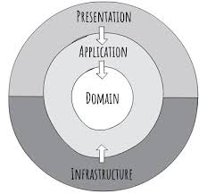

# Favorites API

API para gerenciar os produtos favoritos dos clientes.

---

<details>
<summary>🛠 Tecnologias</summary>

- **Linguagem/Framework:** Node.js, NestJS
- **Banco de Dados:** PostgreSQL
- **ORM:** TypeORM
- **Container:** Docker / Docker Compose
- **Testes:** Jest
- **Documentação:** Swagger (OpenAPI)
</details>

---

<details>
<summary>✨ Funcionalidades</summary>

**Clientes**
- Criar cliente
</details>

---

<details>
<summary>📂 Arquitetura</summary>


- **Clean Architecture:** separação entre domínio, aplicação e infraestrutura
- **Repository:** abstrai acesso ao banco de dados
- **Service:** encapsula regras de negócio
- **Testes:** testes unitários

</details>

---

<details>
<summary>🚀 Configuração de Ambiente</summary>

1. Clone o repositório:
```bash
git clone https://github.com/fernangb/favorites-api
cd favorites-api
```
2. Instale as dependências:
```bash
npm install
```
3. Crie um arquivo .env
```bash
cp .env.example .env
```
4. Adicione os valores nas variáveis de ambiente

5. Rode o Docker:
```bash
docker-compose up -d
```

6. Rode a API:
```bash
npm run start:dev
```

7. Accesse a documentação do Swagger: http://localhost:3000/api

</details>

---

<details> <summary>🧪 Testes</summary>

1. Testes unitários:
```bash
npm run test
```

2. Testes unitários (com cobertura, gerado em coverage/):
```bash
npm run test
```

</details>

---
